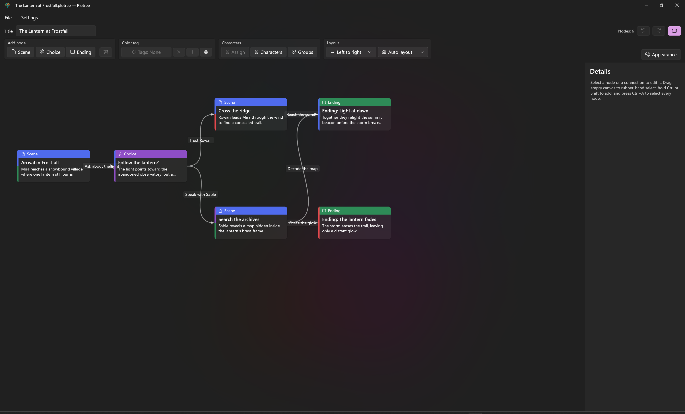
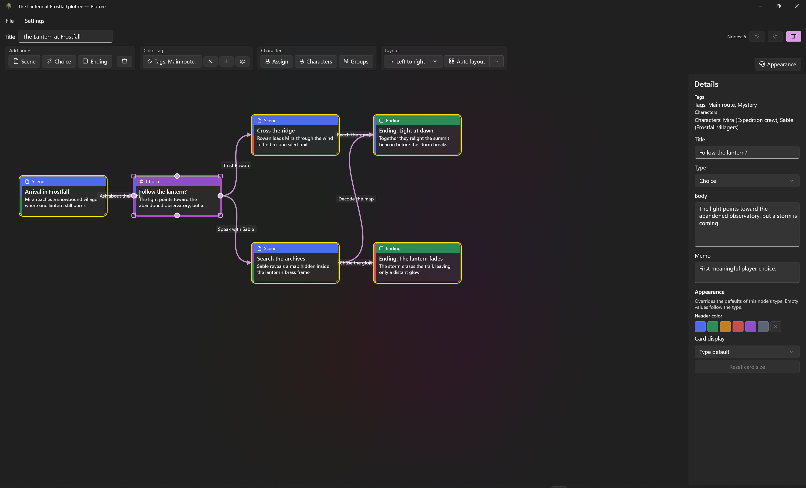

# Plotree

[English](README.md) | [日本語](README.ja.md)

Plotree is a Windows desktop app for outlining branching stories for novels and games. Build a flowchart of scenes, choices, and endings, then keep the writing context for each part of the story in the same project.

Use the canvas to connect narrative beats, edit a node's synopsis and memo in the details panel, and organize the project with color tags, characters, groups, layouts, and card appearance settings.

## Install

Choose either installation method:

- [Microsoft Store](https://apps.microsoft.com/detail/9pfl8jdmmtx6) (recommended): certificate trust and updates are handled automatically.
- Direct installation from [GitHub Releases](https://github.com/Htkym/Plotree/releases/latest): download and extract `Plotree_<version>_DirectInstaller.zip`, then run `Install-Plotree.bat`.

The GitHub version uses a self-signed certificate, so administrator approval is required during the first installation. The installer verifies that the included certificate matches the MSIX bundle before adding it to the Windows Trusted People store. The GitHub version does not update automatically; run the installer again for each new release.

## User manuals

[English user manual](https://htkym.github.io/Plotree/posts/user-manual-en.html) | [日本語版ユーザーマニュアル](https://htkym.github.io/Plotree/posts/user-manual-ja.html)

## Support

Use [GitHub Issues](https://github.com/Htkym/Plotree/issues/new/choose) for bug reports, feature requests, and usage questions. Do not attach `.plotree` files or screenshots containing private story material.

See [Support](SUPPORT.md) and the [privacy policy](https://htkym.github.io/Plotree/posts/privacy-policy-en.html) for details.

## Highlights

- Create scene, choice, and ending nodes, then drag from a node handle to create labeled connections.
- Select multiple nodes to move, tag, assign characters, unpin, or delete them together.
- Copy and paste selected nodes from the toolbar, context menu, or Ctrl+C / Ctrl+V. Connections between copied nodes and their referenced tags and characters are preserved.
- Navigate large graphs with automatic horizontal and vertical scroll bars, canvas panning, mouse-wheel scrolling, and zoom controls.
- Combine automatic layered layout with manually pinned nodes.
- Track node body text, writing memos, color tags, characters, and character groups.
- Map character relationships in a dedicated canvas, with named relationship lines, editable label colors, and character images.
- Share character group memberships between Plot and the character graph, and show or hide each group background independently.
- Choose whether story cards display their assigned characters, with defaults for each node type and per-node overrides.
- Export the graph as PNG or SVG, or export story routes as Markdown or plain text.
- Switch the interface between English and Japanese from **Settings > Language**.

## Character graph and groups

Open **Character graph** to arrange characters and connect them with relationship lines. New lines start with the label “Relationship name”. Select a line to edit its relationship name and label colors in **Details**. Selected characters are marked with a thick white ring, and relationship lines stay selectable where they overlap group backgrounds. PNG and JPEG character images are saved with the project.

A character can belong to several groups. Memberships are shared between **Plot** and **Character graph**, so groups assigned in Plot also appear as backgrounds in the character graph. Changing groups or background colors does not move characters. Nearby members of a group share one background, and distant members get separate backgrounds. Overlapping backgrounds and their names are offset like stairs, and the selected group is drawn in front. Selecting a background shows the group name and members in **Details** and opens editing commands next to it. Use **Group visibility**, next to **Groups**, to show or hide backgrounds.

In Plot, the character manager shows the group list to the right of the character list, and the assignment list can be expanded or collapsed by group. **Details** lists assigned characters one per line with their groups, and you can select the text to copy it. Whether cards show assigned characters is set separately from the title/body display mode, with defaults for each node type and per-node overrides. Characters are hidden on cards by default, and PNG and SVG exports follow the same setting.

## Requirements

- Windows 10 version 1809 or later, or Windows 11

## Notes

- Projects saved with Plotree 1.0.5 cannot be opened in version 1.0.4 or earlier.

## License

See [LICENSE](LICENSE). Third-party notices are available in [THIRD_PARTY_NOTICES.md](THIRD_PARTY_NOTICES.md).
