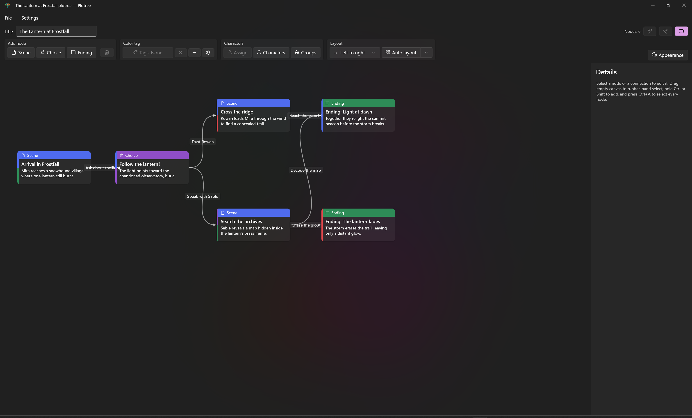
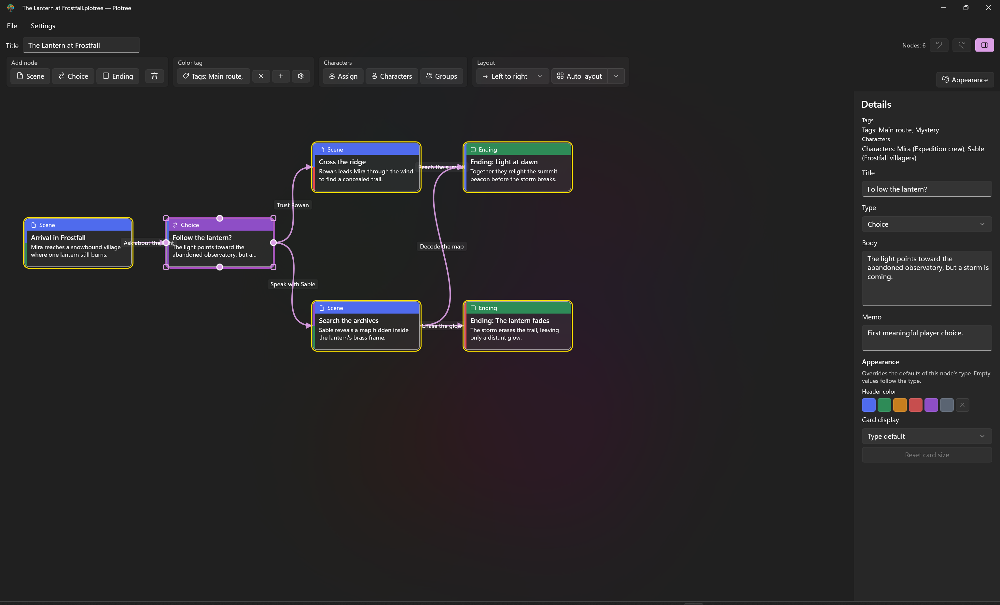
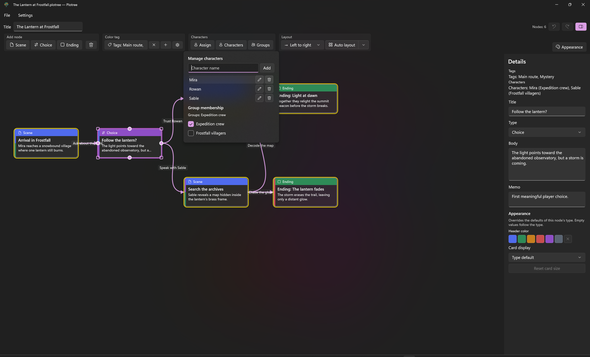
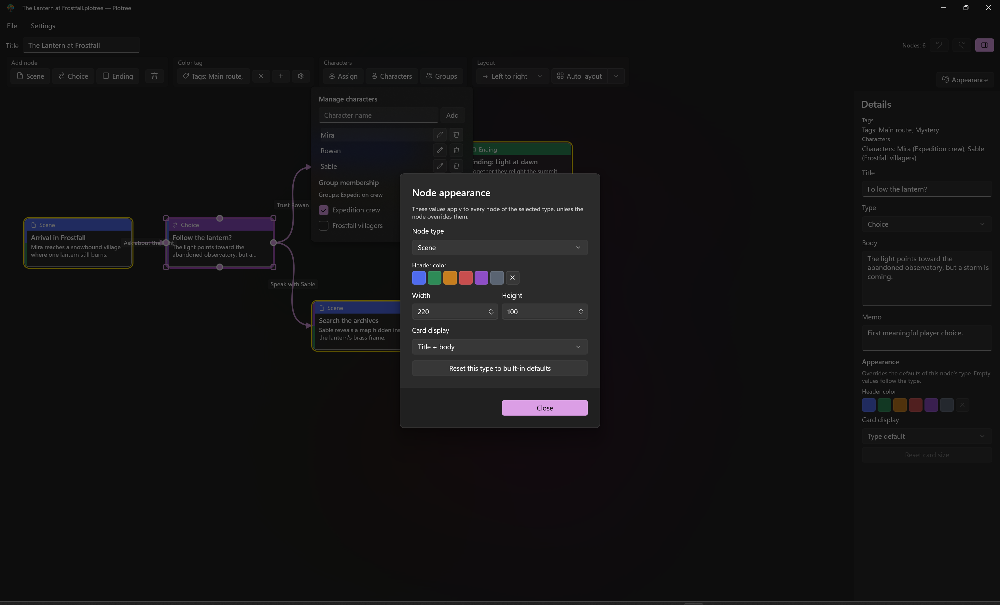

[English](user-manual-en.html) | [日本語](user-manual-ja.html)

Plotree helps writers design a branching narrative as a connected graph. A project contains the story flow, node text, writing notes, tags, characters, groups, and appearance settings.

## Start a project

Use **File > New** to create a project, then enter a project title in the title field. Use **File > Open** to continue a `.plotree` project, and **File > Save** or **Save As** to store it. Plotree files are formatted JSON and remain compatible through file-format migrations.

To open an existing project when launching the app, pass its `.plotree` path as the first command-line argument.

## Build the story flow

1. Add a **Scene**, **Choice**, or **Ending** from the toolbar or the canvas context menu.
2. Select a node to edit its title, body text, and private writing memo in the details panel.
3. Drag from a round handle on a scene or choice node to another node to create a connection.
4. Select a connection to give it a choice label.
5. Add more endings to show alternate outcomes.

Ending nodes do not offer outgoing connection handles. Plotree also prevents self-connections, duplicate connections, and connections that target the start node.

## Organize story context

Create color tags from the **Color tag** toolbar group, then use the tag picker to apply them to every selected node. The picker indicates a mixed state when only part of a multi-selection has a tag.

Use **Characters** to create people in the story and **Groups** to organize them. A character may belong to more than one group. Select nodes and use **Assign** to associate characters with those scenes or choices. The details panel summarizes the assigned tags and characters.

## Arrange the graph

Drag a node to move it. Moved nodes become pinned, so automatic layout preserves their positions. Choose **Left to right** or **Top to bottom** from the layout direction list, then select **Auto layout** to arrange unpinned nodes. Use **Relayout all** from the split-button menu to clear pins and arrange every node.

The canvas supports these gestures:

| Task | Action |
|---|---|
| Pan | Middle-button drag, or hold Space while left-dragging |
| Zoom | Ctrl + mouse wheel |
| Select a node | Click it |
| Select several nodes | Drag on empty canvas, or Ctrl/Shift-click nodes |
| Select all nodes | Ctrl+A outside a text field |
| Remove a selection | Esc |
| Move several nodes | Drag one of the selected nodes |

## Customize card appearance

Select **Appearance** to configure default header color, width, height, and card display for scenes, choices, or endings. A selected node can override its type's defaults in the details panel. Use the reset controls to return to the applicable defaults.

## Edit safely

Use **Ctrl+Z** and **Ctrl+Y** or the toolbar buttons to undo and redo document changes. Text edits and node drag or resize gestures are collected as single history operations. Delete a selected node or connection with the Delete key or its context menu.

## Export

Choose **File > Export** to create:

- **PNG** or **SVG** of the full graph
- **Markdown** or **Text** containing routes from each root node to an ending

Text exports also report dead ends and unreachable nodes.

## Change the interface language

Choose **Settings > Language**, then select **System default**, **Japanese**, or **English**. Restart Plotree after changing the selection so every interface string is reloaded in the selected language.
