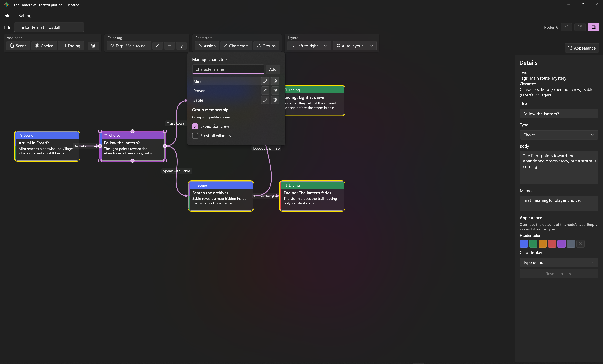
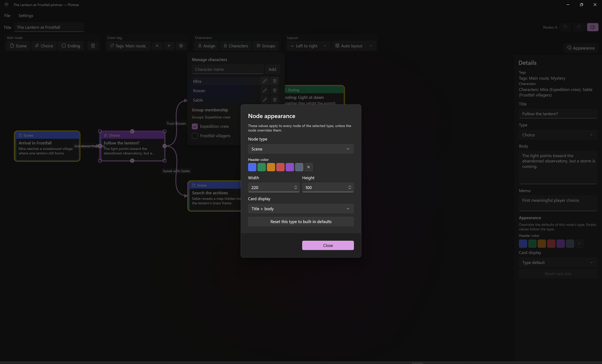

[English](user-manual-en.html) | [日本語](user-manual-ja.html)

Plotree helps writers design a branching narrative as a connected graph. A project contains the story flow, node text, writing notes, tags, characters, groups, and appearance settings.

## Start a project

Use **File > New** to create a project, then enter a project title in the title field. Use **File > Open** to continue a `.plotree` project, and **File > Save** or **Save As** to store it. Plotree files are formatted JSON and remain compatible through file-format migrations.

To open an existing project when launching the app, pass its `.plotree` path as the first command-line argument.

## Build the story flow

1. Add a **Scene**, **Choice**, or **Ending** from the toolbar or the canvas context menu.
2. Select a node to edit its title, body text, and private writing memo in the details panel.
3. Select or point to a scene or choice node, then drag from its round handle to another node to create a connection.
4. Select a connection to give it a choice label.
5. Add more endings to show alternate outcomes.

Ending nodes do not offer outgoing connection handles. Plotree also prevents self-connections, duplicate connections, and connections that target the start node.

Use **Ctrl+C** and **Ctrl+V**, the upper toolbar buttons, or a canvas context menu to copy and paste selected nodes. If both endpoints of a connection are copied, that connection is included. Referenced color tags, characters, and character groups are also carried into the destination project. Each paste is offset from the source so the new nodes remain visible.

## Organize story context

Create color tags from the **Color tag** toolbar group, then use the tag picker to apply them to every selected node. The picker indicates a mixed state when only part of a multi-selection has a tag.

Use **Characters** to create people in the story and **Groups** to organize them. A character may belong to more than one group. Select nodes and use **Assign** to associate characters with those scenes or choices. The details panel summarizes the assigned tags and characters.

In the plot tree, the character manager shows group memberships alongside the character list. Character assignment sections expand and collapse by group. Details list each character on a separate line with all its groups, and text can be selected and copied. Card appearance has an independent character visibility setting, with a document default and per-card override. Existing documents initially keep characters hidden on cards.

## Build a character graph

Choose **Character graph** in the left navigation to see every character in the project as a circular icon. Create and manage characters and groups on the **Plot** screen. Select a character to see their name, groups, and relationships on the right.

Select two characters with Ctrl-click or a marquee to create and save a line immediately. You can also drag the connector beside one character to another. The new relationship starts with the label “Relationship name”. **Add relationship** lets you choose the pair in the editor. Select a line label or a relationship list entry to edit either endpoint, the name, label background, or text color, or to delete the relationship. Colors must be opaque `#RRGGBB` values. Each pair can have only one relationship, regardless of character order. A character cannot be linked to themselves.

Click a character to select it, and Ctrl-click to select several. Drag empty space to select a rectangle; hold Shift or Ctrl to add the rectangle to the current selection. Drag a selected character to move the selection together. Pan with the middle mouse button or hold Space while left-dragging.

Use the **Groups** menu to create a group from the selected characters or add them to an existing group. Edit group names and background colors from the same menu. Group assignments also appear in the Plot screen. Characters may belong to several groups. Removing a selection from all groups removes its shared membership in both tabs. Choose **Choose image** on a character to set a PNG or JPEG avatar. The image fills the circular icon from the center and is stored inside the project file.

Use Ctrl + mouse wheel or the toolbar buttons to zoom, and **Fit all** to bring everyone into view. Character positions, relationships, graph groups, and images are saved in the `.plotree` file. A drag or relationship and group edit can be undone and redone. Use Tab to reach character icons and the relationship list by keyboard.

Groups use the same memberships in both tabs. Grouping and changing background colors preserve character and relationship positions. Each background is calculated from its own group members: nearby members share a background, and distant members have separate backgrounds. Moving a character who belongs only to another group does not resize that background. Overlapping backgrounds are offset; newer groups appear above older ones, and selecting a background brings it to the front and shows its name and members in Details. Click a background for its nearby group menu. Use **Group visibility** next to **Groups** to show or hide backgrounds without changing membership. New connections start with the label “Relationship name”. Selected characters have a thick white ring. Relationship lines keep their visible widths and have a wider click target above group backgrounds. Every group name is a separate selectable button; overlapping backgrounds and their names move together in a staircase, with the frontmost at the lower left and each background behind it further up and right. Selecting another group preserves character positions. Top menus open below their buttons and stay inside the application window.

## Arrange the graph

Drag a node to move it. Moved nodes become pinned, so automatic layout preserves their positions. Choose **Left to right** or **Top to bottom** from the layout direction list, then select **Auto layout** to arrange unpinned nodes. Use **Relayout all** from the split-button menu to clear pins and arrange every node.

Horizontal and vertical scroll bars appear automatically when graph elements extend beyond the visible area. The canvas supports these gestures:

| Task | Action |
|---|---|
| Pan | Left-drag empty canvas, middle-button drag, or hold Space while left-dragging |
| Scroll | Mouse wheel vertically, or Shift + mouse wheel horizontally |
| Zoom | Ctrl + mouse wheel, Ctrl++ / Ctrl+-, the upper toolbar buttons, or the canvas context menu |
| Select a node | Click it |
| Select several nodes | Shift + drag on empty canvas, or Ctrl/Shift-click nodes |
| Add a marquee to the selection | Ctrl+Shift + drag on empty canvas |
| Select all nodes | Ctrl+A outside a text field |
| Remove a selection | Esc |
| Move several nodes | Drag one of the selected nodes |

## Customize card appearance

Select **Appearance** to configure default header color, width, height, and card display for scenes, choices, or endings. A selected node can override its type's defaults in the details panel. Use the reset controls to return to the applicable defaults.

## Edit safely

Use **Ctrl+Z** and **Ctrl+Y** or the toolbar buttons to undo and redo document changes. Text edits, node drag or resize gestures, and each paste are collected as single history operations. Delete a selected node or connection with the Delete key or its context menu.

## Export

Choose **File > Export** to create:

- **PNG** or **SVG** of the full graph
- **Markdown** or **Text** containing routes from each root node to an ending

Text exports also report dead ends and unreachable nodes.

## Change the interface language

Choose **Settings > Language**, then select **System default**, **Japanese**, or **English**. Restart Plotree after changing the selection so every interface string is reloaded in the selected language.
