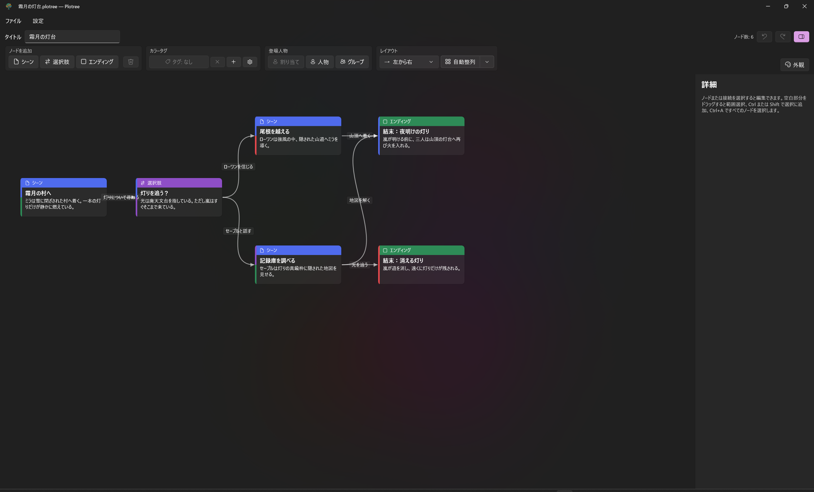
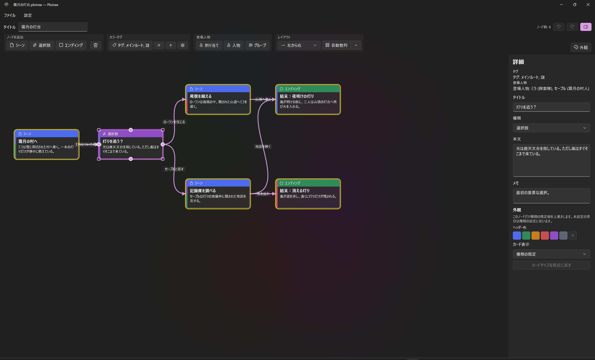
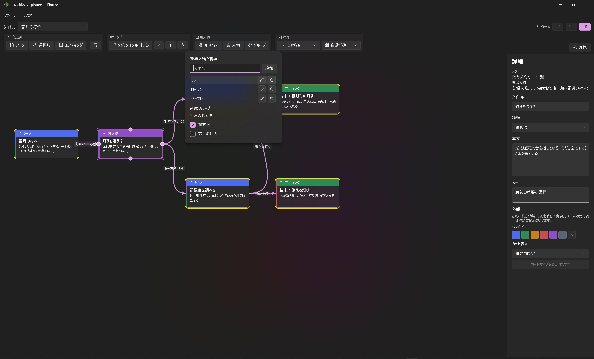
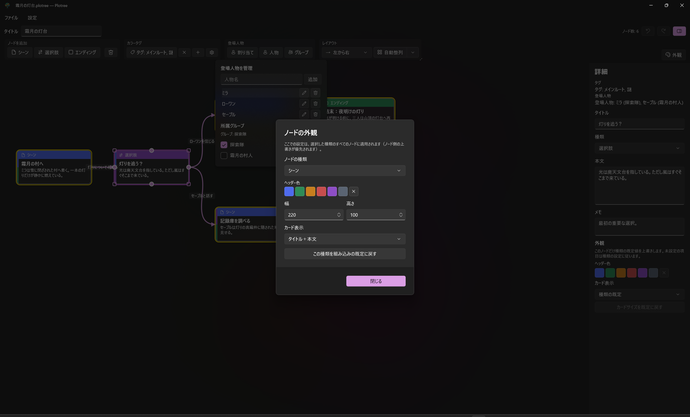

# Plotree ユーザーマニュアル

[English](user-manual-en.html) | [日本語](user-manual-ja.html)

Plotree は、小説やゲームの分岐する物語をグラフとして設計するアプリです。プロジェクトには、物語の流れ、ノードの本文とメモ、タグ、登場人物、グループ、外観設定をまとめて保存できます。

## プロジェクトを始める

**ファイル > 新規**でプロジェクトを作成し、タイトル欄に作品名を入力します。既存の `.plotree` ファイルは **ファイル > 開く** で開き、**保存** または **名前を付けて保存** で保存します。`.plotree` は整形済み JSON のファイルで、形式更新時には移行処理が行われます。

起動時に `.plotree` ファイルのパスを最初のコマンドライン引数として渡すと、そのプロジェクトを開けます。

## 物語の流れを作る

1. ツールバーまたはキャンバスの右クリックメニューから、**シーン**、**選択肢**、**エンディング**を追加します。
2. ノードを選択し、右の詳細パネルでタイトル、本文、執筆用メモを編集します。
3. シーンまたは選択肢ノードの丸いハンドルから別のノードへドラッグして、接続を作成します。
4. 接続線を選択し、選択肢ラベルを入力します。
5. エンディングを追加して、複数の結末を設計します。

エンディングノードには出力用の接続ハンドルがありません。また、自己接続、重複接続、Start ノードを対象にした接続は作成できません。

## 物語の情報を整理する

**カラータグ**グループでタグを作成し、タグの選択画面から選択中のすべてのノードへ付けます。複数選択で一部のノードだけにタグが付いている場合は、混在状態として表示されます。

**人物**から登場人物を作成し、**グループ**で整理できます。人物は複数のグループに所属できます。ノードを選択した状態で **割り当て** を使うと、シーンや選択肢に登場人物を関連付けられます。右の詳細パネルには、タグと登場人物の要約が表示されます。

## グラフを整える

ノードをドラッグすると位置を移動できます。移動したノードはピン留めされ、自動整列でも位置が維持されます。レイアウト方向で **左から右** または **上から下** を選び、**自動整列**を実行すると、ピン留めされていないノードが配置されます。分割ボタンの **すべて再整列** は、ピンを解除してすべてのノードを配置します。

キャンバスでは次の操作ができます。

| 操作 | 方法 |
|---|---|
| パン | 中ボタンドラッグ、または Space を押しながら左ドラッグ |
| ズーム | Ctrl + マウスホイール |
| ノードを選択 | ノードをクリック |
| 複数ノードを選択 | 空白部分をドラッグ、または Ctrl / Shift を押しながらノードをクリック |
| すべて選択 | テキスト入力中以外で Ctrl+A |
| 選択を解除 | Esc |
| 複数ノードを移動 | 選択中のノードのいずれかをドラッグ |

## ノードの外観を設定する

**外観**を選択すると、シーン、選択肢、エンディングごとにヘッダー色、幅、高さ、カード表示を設定できます。選択したノードは、右の詳細パネルで種類ごとの既定を個別に上書きできます。リセット操作で該当する既定値に戻せます。

## 安全に編集する

**Ctrl+Z**、**Ctrl+Y**、またはツールバーのボタンで、編集を取り消し・やり直しできます。テキスト入力、ノードの移動、サイズ変更は、それぞれ一つの履歴操作として扱われます。選択中のノードまたは接続は Delete キーか右クリックメニューから削除できます。

## エクスポートする

**ファイル > エクスポート**から、次の形式で出力できます。

- グラフ全体の **PNG** または **SVG**
- 起点からエンディングまでのルートをまとめた **Markdown** または **テキスト**

テキスト形式の出力には、行き止まりや到達できないノードの警告も含まれます。

## 表示言語を切り替える

**設定 > 言語**から、**システム既定**、**日本語**、**English**を選択します。選択後に Plotree を再起動すると、選んだ言語ですべての UI 文字列が表示されます。
