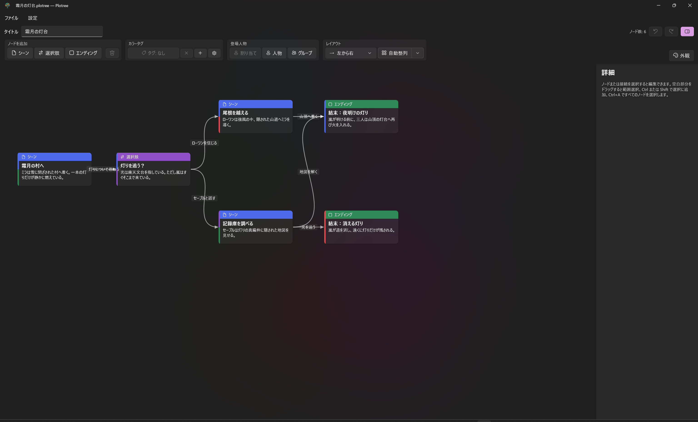
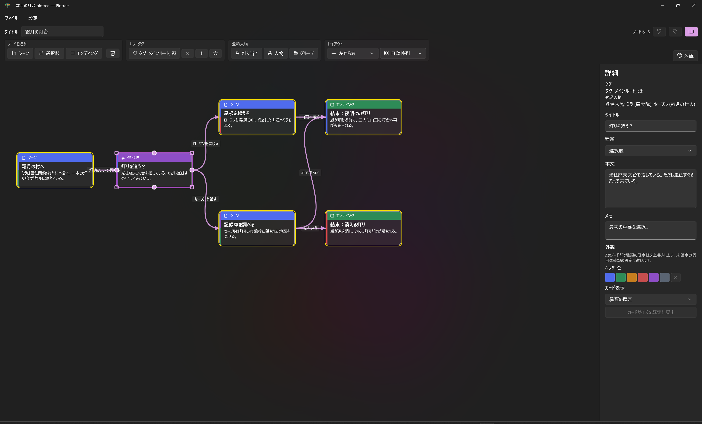
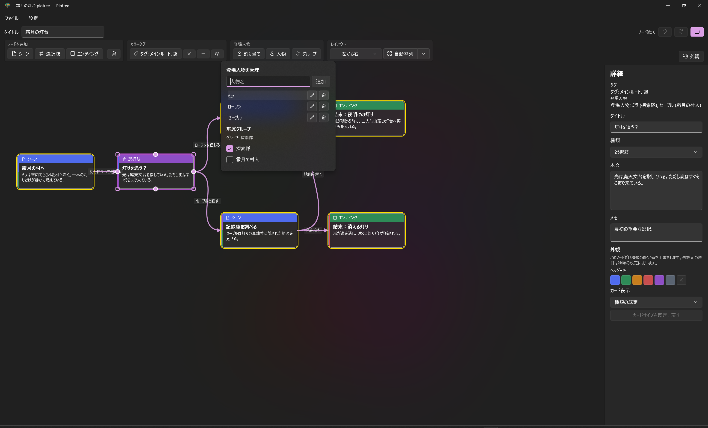
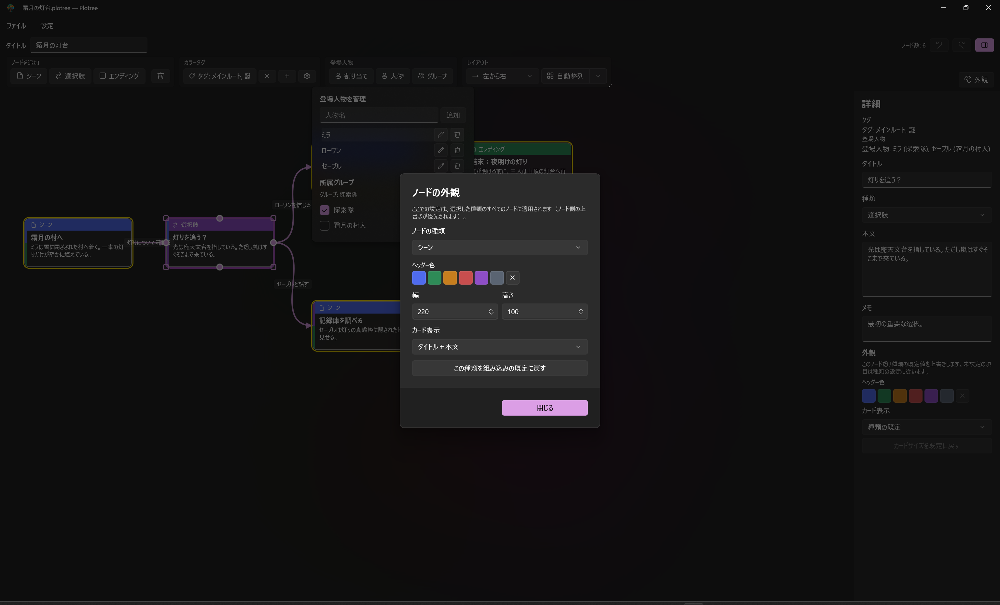

[English](user-manual-en.html) | [日本語](user-manual-ja.html)

Plotree は、小説やゲームの分岐する物語をグラフとして設計するアプリです。プロジェクトには、物語の流れ、ノードの本文とメモ、タグ、登場人物、グループ、外観設定をまとめて保存できます。

## プロジェクトを始める

**ファイル > 新規**でプロジェクトを作成し、タイトル欄に作品名を入力します。既存の `.plotree` ファイルは **ファイル > 開く** で開き、**保存** または **名前を付けて保存** で保存します。`.plotree` は整形済み JSON のファイルで、形式更新時には移行処理が行われます。

起動時に `.plotree` ファイルのパスを最初のコマンドライン引数として渡すと、そのプロジェクトを開けます。

## 物語の流れを作る

1. ツールバーまたはキャンバスの右クリックメニューから、**シーン**、**選択肢**、**エンディング**を追加します。
2. ノードを選択し、右の詳細パネルでタイトル、本文、執筆用メモを編集します。
3. シーンまたは選択肢ノードを選択するかポインターを重ね、表示された丸いハンドルから別のノードへドラッグして接続を作成します。
4. 接続線を選択し、選択肢ラベルを入力します。
5. エンディングを追加して、複数の結末を設計します。

エンディングノードには出力用の接続ハンドルがありません。また、自己接続、重複接続、Start ノードを対象にした接続は作成できません。

選択中のノードは、**Ctrl+C** と **Ctrl+V**、上部のボタン、またはキャンバスの右クリックメニューからコピーして貼り付けられます。接続の両端がコピー対象に含まれる場合は、その接続もコピーされます。割り当て済みのカラータグ、登場人物、グループも貼り付け先へ引き継がれます。貼り付けるたびに位置がずれるため、元のノードと重ならずに確認できます。

## 物語の情報を整理する

**カラータグ**グループでタグを作成し、タグの選択画面から選択中のすべてのノードへ付けます。複数選択で一部のノードだけにタグが付いている場合は、混在状態として表示されます。

**人物**から登場人物を作成し、**グループ**で整理できます。人物は複数のグループに所属できます。ノードを選択した状態で **割り当て** を使うと、シーンや選択肢に登場人物を関連付けられます。右の詳細パネルには、タグと登場人物の要約が表示されます。

ツリーの人物管理では、人物一覧の右側にグループ所属一覧を表示します。人物割り当てはグループごとに展開・折りたたみできます。詳細には人物ごとに1行ずつ、所属する全グループとともに表示し、文字を選択してコピーできます。カードの外観では、人物の表示・非表示をドキュメントの既定値とカードごとの上書きで設定できます。既存文書では、初期状態のカードは人物を非表示にします。

## 人物相関図を作る

左側のナビゲーションで**人物相関図**を選ぶと、プロジェクト内の人物が円形のアイコンで表示されます。人物とグループの追加・編集は**プロット**画面で行います。人物を選ぶと、右側で名前、所属グループ、関係を確認できます。

人物を Ctrl + クリックや範囲選択で2人選ぶと、その場で線を作成して保存します。アイコンの横にある接続ボタンから別の人物へドラッグしても作成できます。作成時のラベルは「関係名」です。**関係を追加**から2人を指定して作成することもできます。関係の線上にあるラベル、または右側の関係一覧を選ぶと、両端の人物、関係名、ラベルの背景色と文字色を編集・削除できます。色は不透明な `#RRGGBB` で指定します。同じ2人の関係は1件までで、人物の順序を入れ替えても重複として扱われます。自分自身との関係は作成できません。

人物をクリックすると選択し、Ctrl + クリックで複数の人物を選択できます。空白部分をドラッグすると範囲選択できます。Shift または Ctrl を押しながら範囲選択すると、現在の選択へ追加します。選択した人物を動かすと、まとめて移動します。空白部分のパンには中ボタンドラッグ、または Space キーを押しながら左ドラッグを使います。

上部の**グループ分け**メニューから、選択した人物でグループを作成するか、既存のグループへ追加できます。グループ名と背景色はメニューから編集できます。割り当てた人物はプロット画面でもそのグループの所属として表示されます。人物は複数のグループに所属できます。**選択した人物をすべてのグループから外す**操作では、両タブで共有される所属を解除します。人物アイコンの**画像を選択**から PNG または JPEG を設定できます。画像は中央を基準に円の内側いっぱいに表示し、プロジェクトファイルに含めて保存します。

人物のアイコンをドラッグすると位置を変更できます。Ctrl + マウスホイールまたは上部のボタンで拡大・縮小し、**全体表示**で人物全員を表示範囲に収められます。人物の位置、関係、グループ、画像は `.plotree` ファイルに保存されます。移動1回や関係・グループの編集は、元に戻す・やり直しの対象です。人物や関係一覧は Tab キーで移動して選択できます。

グループ所属はツリーと人物の両タブで共有されます。グループ分けや背景色の変更では人物と線の位置は変わりません。各グループ自身の所属人物だけから背景の範囲を求め、近くの人物は背景をまとめ、離れた人物には個別の背景を表示します。別グループだけに所属する人物の移動では、その背景の大きさは変わりません。重なる背景は少しずらし、後から作成したグループを上に表示します。背景を選択するとそのグループが手前になり、詳細に名前と所属人物が表示されます。背景をクリックすると、そのそばにグループのメニューが開きます。「グループ分け」の右隣にある「グループの表示」で、所属を保ったまま背景を表示・非表示にできます。新しい関係の初期ラベルは「関係名」です。選択した人物には太い白い輪を表示します。関係の線の見た目の太さは保ったままクリック範囲を広げ、グループ背景より前面で選択できます。各グループ名は個別に選択できるボタンです。重なる背景と名前は一緒に階段状にずらし、最前面を左下、その後ろを順に右上に表示します。選択を切り替えても人物の位置は変わりません。上部メニューは項目の下、アプリ画面内に開きます。

## グラフを整える

ノードをドラッグすると位置を移動できます。移動したノードはピン留めされ、自動整列でも位置が維持されます。レイアウト方向で **左から右** または **上から下** を選び、**自動整列**を実行すると、ピン留めされていないノードが配置されます。分割ボタンの **すべて再整列** は、ピンを解除してすべてのノードを配置します。

グラフの要素が表示範囲から外れると、縦横のスクロールバーが自動的に表示されます。キャンバスでは次の操作ができます。

| 操作 | 方法 |
|---|---|
| パン | 空白部分を左ドラッグ、中ボタンドラッグ、または Space を押しながら左ドラッグ |
| スクロール | マウスホイールで縦方向、Shift + マウスホイールで横方向 |
| ズーム | Ctrl + マウスホイール、Ctrl++ / Ctrl+-、上部ボタン、またはキャンバスの右クリックメニュー |
| ノードを選択 | ノードをクリック |
| 複数ノードを選択 | Shift を押しながら空白部分をドラッグ、または Ctrl / Shift を押しながらノードをクリック |
| 範囲選択を既存の選択へ追加 | Ctrl+Shift を押しながら空白部分をドラッグ |
| すべて選択 | テキスト入力中以外で Ctrl+A |
| 選択を解除 | Esc |
| 複数ノードを移動 | 選択中のノードのいずれかをドラッグ |

## ノードの外観を設定する

**外観**を選択すると、シーン、選択肢、エンディングごとにヘッダー色、幅、高さ、カード表示を設定できます。選択したノードは、右の詳細パネルで種類ごとの既定を個別に上書きできます。リセット操作で該当する既定値に戻せます。

## 安全に編集する

**Ctrl+Z**、**Ctrl+Y**、またはツールバーのボタンで、編集を取り消し・やり直しできます。テキスト入力、ノードの移動、サイズ変更、1 回の貼り付けは、それぞれ一つの履歴操作として扱われます。選択中のノードまたは接続は Delete キーか右クリックメニューから削除できます。

## エクスポートする

**ファイル > エクスポート**から、次の形式で出力できます。

- グラフ全体の **PNG** または **SVG**
- 起点からエンディングまでのルートをまとめた **Markdown** または **テキスト**

テキスト形式の出力には、行き止まりや到達できないノードの警告も含まれます。

## 表示言語を切り替える

**設定 > 言語**から、**システム既定**、**日本語**、**English**を選択します。選択後に Plotree を再起動すると、選んだ言語ですべての UI 文字列が表示されます。
